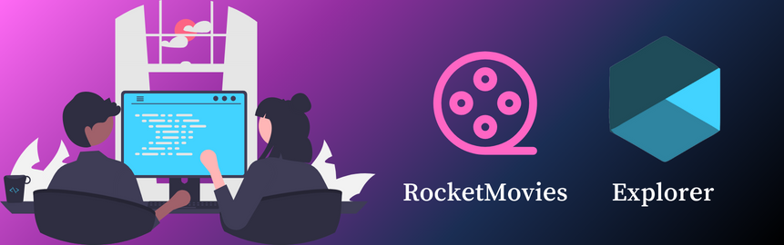

<div style="display: inline-flex; align-items: center; border-radius: 5px;">
  
  <strong style="font-size: 35px">RocketMovies Front-end</strong>
</div>

## 

<div style="display: inline-flex; align-items: center; padding: 5px; border-radius: 5px;">
  
  <strong style="font-size: 20px">RocketMovies Tecnologias usadas.</strong>
</div>

<div style="display: inline-flex; align-items: center;">
   Lib JavaScript usada para criar interfaces de usuário interativas.
</div>

<div style="display: inline-flex; align-items: center;">
  Uma extensão do React para lidar com manipulação do Document Object Model (DOM).
</div>

<div style="display: inline-flex; align-items: center;">
  Uma lib de ícones populares para adicionar ícones a componentes React.
</div>

<div style="display: inline-flex; align-items: center;">
  Uma lib para adicionar roteamento à sua aplicação React
</div>

<div style="display: inline-flex; align-items: center;">
   Uma lib para estilização de componentes reutilizáveis com CSS no JavaScript.
</div>

<div style="display: inline-flex; align-items: center;">
  Um cliente HTTP baseado em promises para fazer solicitações à API do projeto
</div>

---

<div style="display:flex f  align-items: center; padding: 5px; border-radius: 5px;">
 <div style="display: inline-flex; align-items: center; padding: 5px; border-radius: 5px;">
  
  <strong style="font-size: 20px">RocketMovies Sobre</strong>
</div>
  <p>RocketMovies é uma plataforma web dedicada à catalogação e avaliação de filmes. Os usuários podem criar notas e comentários, atribuir tags aos filmes, além de explorar filmes de acordo com categorias, diretoria, gênero e outros critérios. A plataforma também suporta pesquisa por título e visualização de detalhes de cada filme, incluindo informações como sinopse.</p>
   
</div>

---

<div style="display: inline-flex; align-items: center; padding: 5px; border-radius: 5px;">
  
  <strong style="font-size: 15px">Esse projeto e divido em 2 repositórios, esse sendo o front-end.Para acessar repositório Back-end <a href="https://github.com/Mar0la/RocketMovies-BackEnd">acesse</a>
.</strong>
</div>

---

### Instalação e Execução do Projeto

- Clone este repositório

```
> git clone https://github.com/Mar0la/RocketMovies-FrontEnd
```

- Navegue até o diretório principal do projeto

```
> cd RocketMovies-FrontEnd
```

- Instale as dependências com o Yarn

```
yarn ou npm install
```

- Rode a aplicação

```
yarn dev ou npm run dev
```

---

**Nota**: Este repositório é um dos projetos que decidi postar separadamente do repositório principal da trilha **Explorer da RocketSeat**. Não vou postar deploy mais ensinarei como rodar o projeto, lembrando que são 2 repositórios. visite o repositório principal.

## [Repositório da Trilha](https://github.com/Mar0la/Explorer)
